# 🎯 LoL Icon Diffusion — Text-to-Image with LoRA

An end-to-end text-to-image project: 

collect League of Legends profile icons → filter with CLIP + binary head → generate captions with BLIP → fine-tune Stable Diffusion with LoRA → generate high-quality icons **directly from text prompts**.

> **Highlights**  
> - Pure text-to-image: generate icons from prompts, not from input images  
> - Fully reproducible pipeline: data → labeling (filtering) → training → inference  
> - Transparent setup (thresholds, models, training parameters)

---

## 🔥 Sample Results

> Showcase your generated images with their text prompts


| Text Prompt | Generated Image                           |
|-------------|-------------------------------------------|
| *"a <lolicon> League of Legends style icon of a cartoon character with a cat face and a blue hair"* | 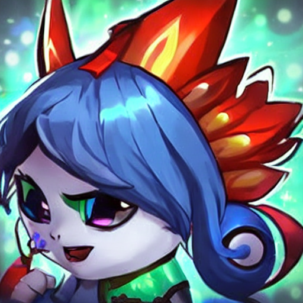 |
| *"a <lolicon> League of Legends style icon of a dark knight in heavy armor"* | 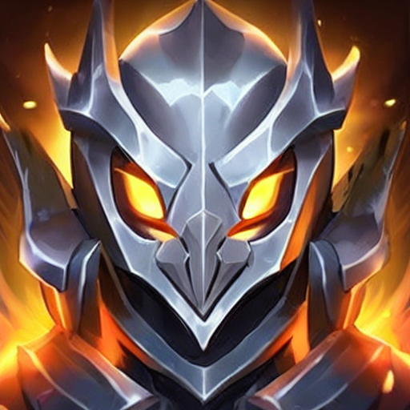 |
| *"a <lolicon> League of Legends style icon of a radiant archer with golden bow"* | 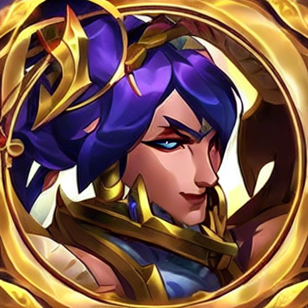 |
| *"a <lolicon> League of Legends style icon of a cybernetic assassin with glowing red eyes"* | 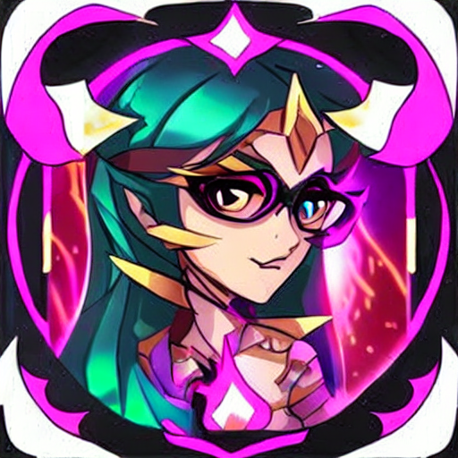 |
| *"a <lolicon> League of Legends style icon of a cartoon character with blue hair and a purple dress"* | 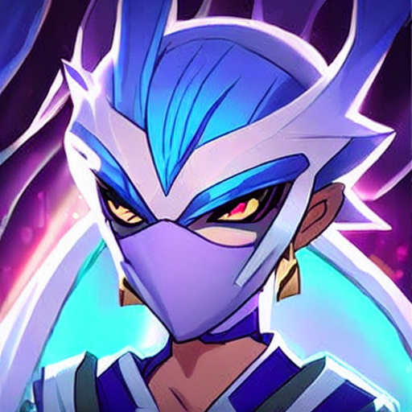 |

More samples in `assets/gallery/`

## 🎨 More Samples

| 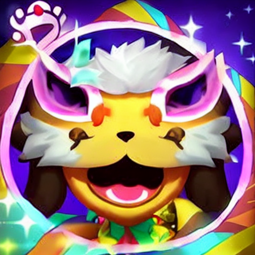  | 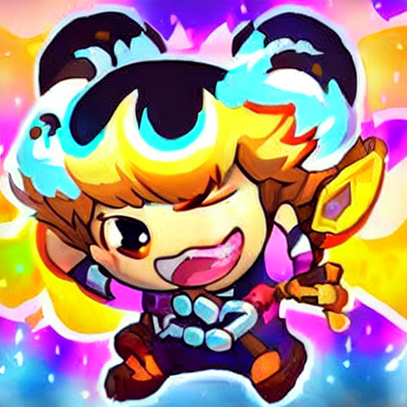 | 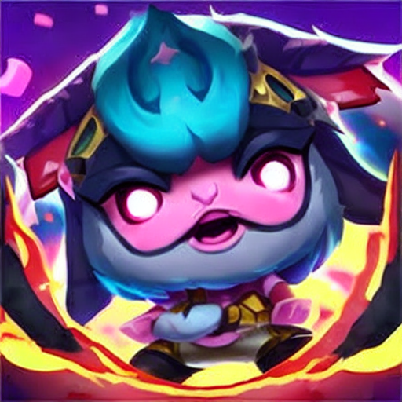  |
|--------------------------------------------------------------------|-------------------------------------------------------------------|--------------------------------------------------------------------|
| 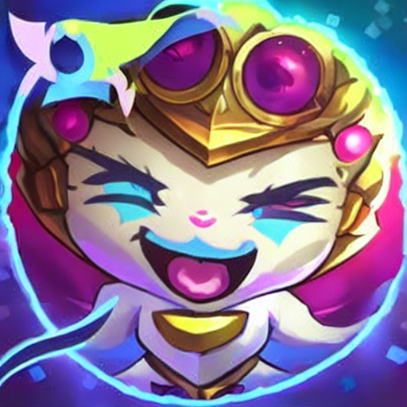  | 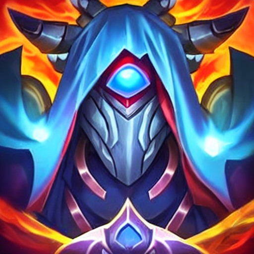 | 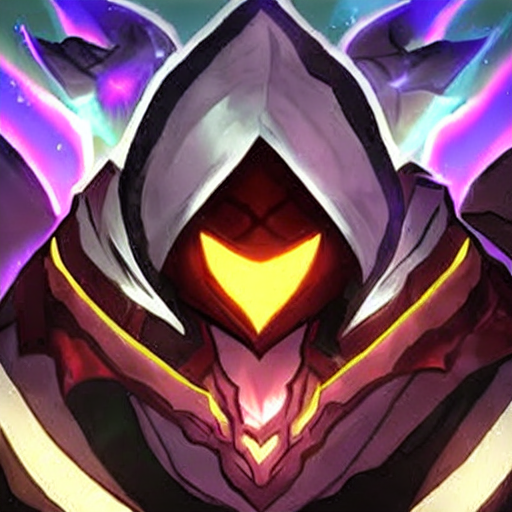  |
| 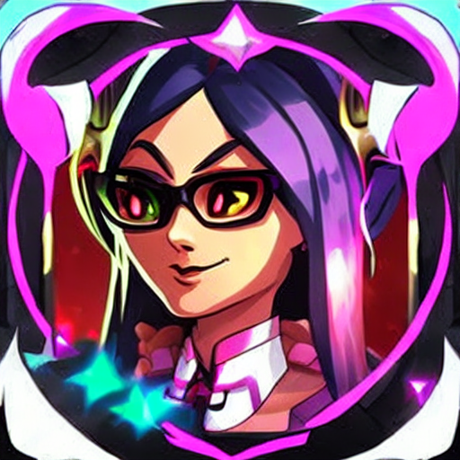  | 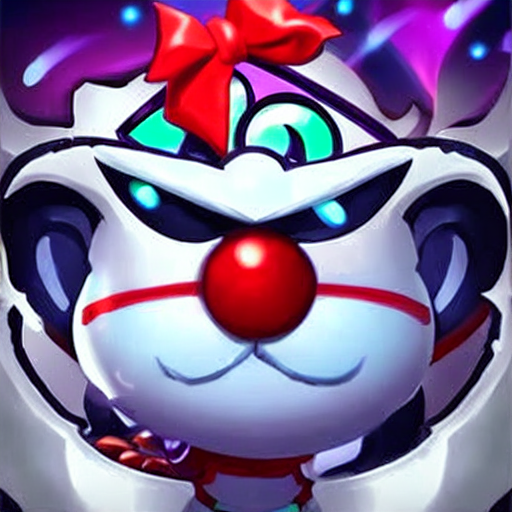 |   |
| 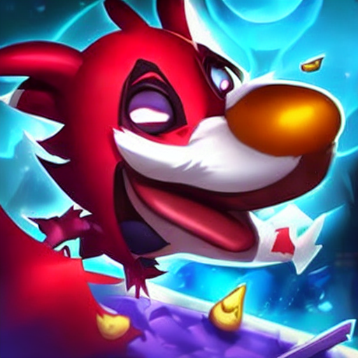 | 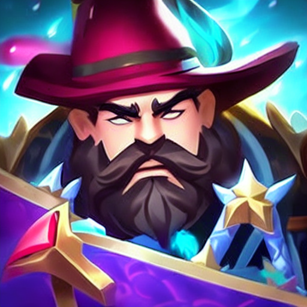| 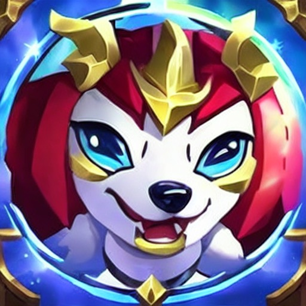 |
| 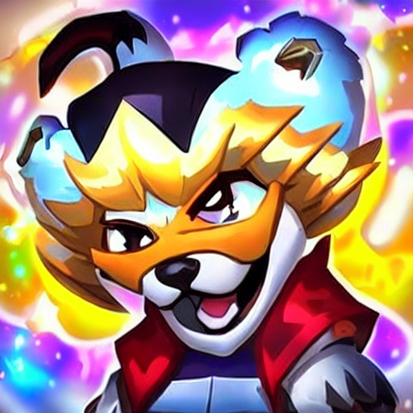 | 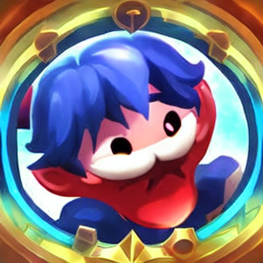|  |


## 🧭 Pipeline Overview

```mermaid
flowchart LR
  A[Download LoL Icons] --> B[CLIP + Binary Head\nFilter “liked” icons]
  B --> C[BLIP Auto-Captioning\nGenerate image-text pairs]
  C --> D[LoRA Fine-tune Stable Diffusion]
  D --> E[Text-to-Image Generation\nNew icons from prompts]
